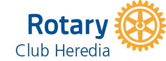
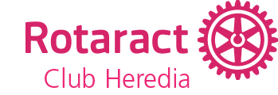

  

# End Polio Now - Rotary Costa Rica

End Polio Now pin sales website for Rotary Costa Rica.

A project by Rotary Club Heredia and Rotaract Club Heredia, led by Diana Lescure.

## Development

Even though it is not strictly necessary, I used [BrowserSync](https://www.browsersync.io/) to be able to develop in my browser locally with "Hot Reloading" (I save, browser gets update automagically).

To get started with this workflow you have to follow three simple steps from your terminal (in OSX):

- Install XCode developer tools
- Install NVM with latest long term support (LTS) version of Node.js
- Run BrowserSync using `npx` in the root of this repository

Keep reading for detailed instructions for each step...

### Install XCode developer tools

To install XCode developer tools simply open your terminal and run the following command:

```bash
git
```

This will cause a prompt to pop up asking if you want to install XCode developer tools, click "OK" and let it do its thing (it might take a while depending on your internet speed).

### Install NVM with latest long term support (LTS) version of Node.js

Once XCode developer tools has been installed you can proceed with running the following commands on your terminal:

```bash
echo '' >> ~/.bash_profile
chmod +x ~/.bash_profile
curl -o- https://raw.githubusercontent.com/creationix/nvm/v0.34.0/install.sh | bash
~/.bash_profile
nvm install --lts
nvm use --lts
```

This is going to produce quite a bit of output, which is ok.

Eventually you'll get this message which means it's done:

```
Computing checksum with shasum -a 256
Checksums matched!
Now using node v10.15.3 (npm v6.4.1)
```

_(version numbers might differ on your message)_

### Run BrowserSync using `npx` in the root of this repository

Finally, once you have Node.js installed in your system, run the following in your terminal:

```bash
npx browser-sync start -s -f . --no-notify --host `ifconfig | grep "inet " | grep -v 127.0.0.1 | cut -d\  -f2` --port 8080
```

You should see an output similar to:

```
[Browsersync] Access URLs:
 --------------------------------------
       Local: http://localhost:8080
    External: http://192.168.0.101:8080
 --------------------------------------
          UI: http://localhost:3001
 UI External: http://localhost:3001
 --------------------------------------
[Browsersync] Serving files from: ./
[Browsersync] Watching files...
```

And your browser shoudl automagically open up with the homepage of this project.
